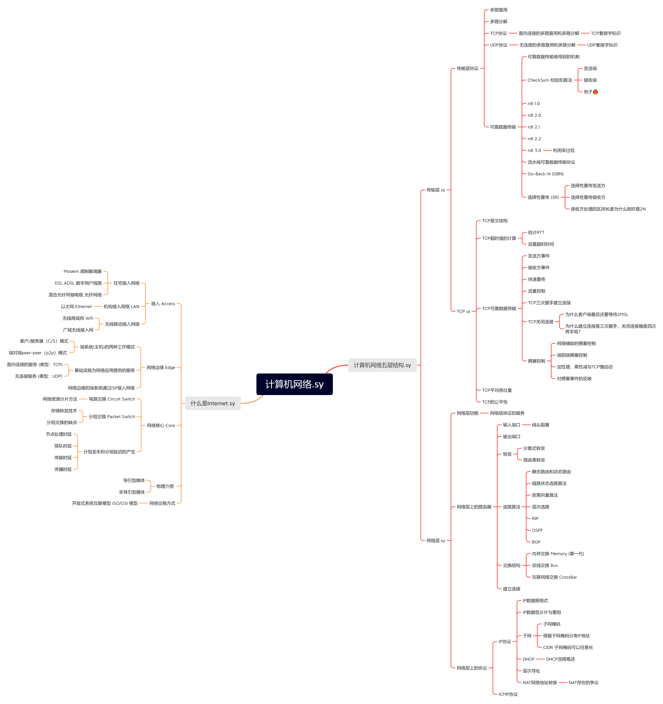

<h1 align="center">Note Map</h1>
✨ 一键导出当前目录下所有大纲并组合为思维导图

思维导图格式为`.xmind`，需要用**Xmind**打开哦~

可以用于复习时，对着大纲回想笔记内容~

## 效果图

## 食用方法

1. 引入挂件
2. 点击按钮
3. 完成！

导出后即可删除挂件，也可以保留方便下次使用~

### 目前已知问题

如果当前文件没有子文件，则无法正确导出当前文件大纲。这是判断当前笔记本的逻辑问题，将在下个版本修复~